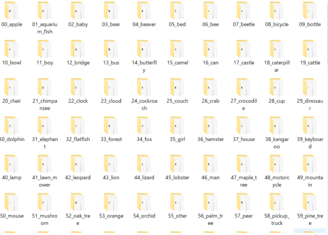
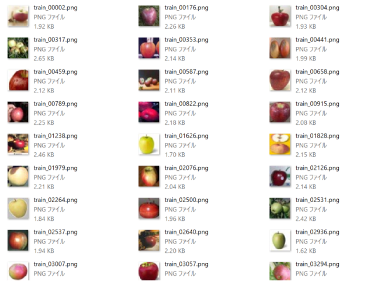
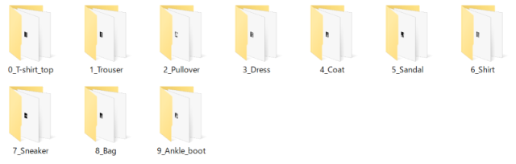
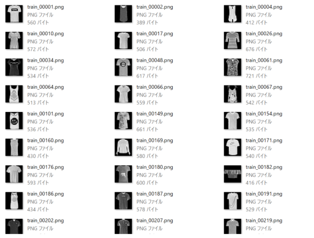
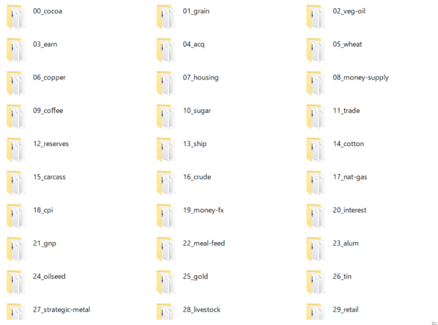
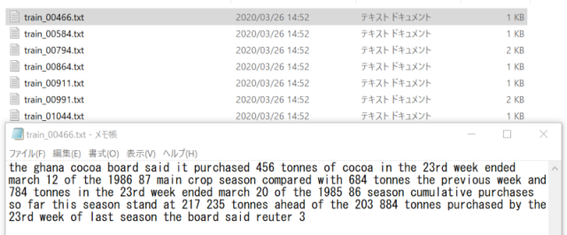

# Save_TF_Keras_Dataset
## Tensorflow Keras APIからロードしたデータをローカル保存するコード 
Tensorflow 2.1 にて動作確認  

以下のデータセットを画像またはテキスト保存します  
* CIFAR10 -> 画像保存
* CIFAR100 -> 画像保存
* MNIST-> 画像保存
* Fashion-MNIST -> 画像保存
* IMDB Review -> テキスト保存
* Reuters Topics -> テキスト保存
* Boston Housing data -> CSV保存

↓ 詳しい説明は、こちらで説明しています。  
https://maxigundan.com/deeplearning/?p=99

# 使い方
`python save_tf_keras_dataset.py`

0: end  
1: Save CIFAR10 images  
2: Save CIFAR100 images  
3: Save MNIST images  
4: Save Fasion-MNIST images  
5: Save IMDB Review Texts  
6: Save Reuters Topics Texts  
7: Save Boston Housing data CSV  
select menu ->  

上記のメニューが表示されるので、  
番号を入力することでそれぞれ実行する、レトロスタイルです。

# 実行結果サンプル

* CIFAR100  
  
  

* Fasion-MNIST  
  
  

* Reuter Topics  
  
  
